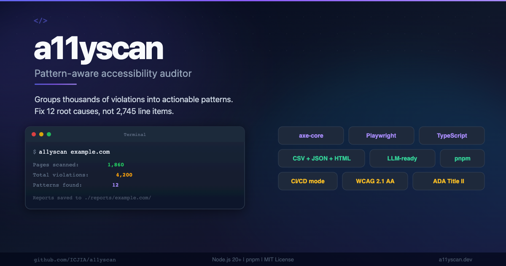

<p align="center">
  
</p>

# a11yscan

A pattern-aware CLI tool that audits websites for ARIA role violations, missing accessible names, and color contrast failures using axe-core. Built for web teams managing large multi-page or SPA-based sites under ADA Title II compliance deadlines.

Instead of dumping thousands of per-page violations, a11yscan groups findings by **pattern** — the combination of violation type and normalized CSS selector. A single Vuetify `v-autocomplete` generating a bad `role="listbox"` on 340 pages is reported as one pattern with 340 affected URLs, not 340 separate violations. This transforms a 1,860-page audit into a 12-pattern remediation list.

## Why a11yscan?

### The problem with traditional accessibility tools

Enterprise accessibility scanners like SiteImprove, WAVE, or Lighthouse generate results per page. A 500-page site with a broken Vuetify autocomplete on every page produces:

> **SiteImprove: "2,745 violations found"**

That's not actionable. A developer staring at 2,745 line items can't tell whether there are 2,745 unique problems or 5 repeated patterns. Most of those violations come from the same handful of components rendered across hundreds of pages.

### What a11yscan does differently

a11yscan groups violations by the *root cause* — the combination of the axe-core rule ID and the CSS selector where it occurs. The same 2,745 violations become:

> **a11yscan: "12 patterns found across 500 pages"**

Each pattern tells you exactly what's broken, where it appears, how many pages it affects, and what framework component is likely responsible. You fix 12 things, not 2,745.

### Pattern-grouped reports

Every report format — JSON, CSV, HTML, and Markdown — groups violations by pattern type. All `color-contrast` patterns appear together, all `aria-roles` patterns together. Each group shows:

- The violation description and fix guide link
- Total patterns and affected pages for that violation type
- Individual patterns with selectors, HTML snippets, and affected URLs

### LLM-ready reports

The JSON report includes everything an LLM needs to generate fixes without human hand-holding:

- **`htmlSnippet`** — the actual DOM element markup that failed
- **`failureSummary`** — axe-core's plain-English fix instructions
- **`rawSelector`** — the full CSS selector path to the element
- **`suggestedFix`** — link to the Deque University fix guide
- **`rootCauseHint`** — which framework component is likely responsible

Feed the JSON to Claude, GPT, or any code-generation LLM and get actionable diffs back.

### User stories

**State agency webmaster with 1,800+ pages and an ADA Title II deadline:**
> "SiteImprove told us we had 4,200 violations. We didn't know where to start. a11yscan showed us it was actually 15 patterns — 8 from Vuetify components and 7 from our custom navigation. We fixed all 15 in two sprints."

**University web team managing a Nuxt/Vue marketing site:**
> "We run `a11yscan --filter /admissions` before every release. It catches new ARIA issues from our component library before they multiply across 200 admissions pages."

**DevOps engineer integrating accessibility into CI/CD:**
> "We use `--ci` mode in our GitHub Actions pipeline. If the scan finds violations, the build fails with a machine-readable JSON summary. No more surprises in production."

**Freelance developer auditing a client's WordPress site:**
> "The root cause hints immediately told me which violations came from the theme vs. which came from plugins. I could give the client a clear, prioritized fix list instead of a 40-page PDF."

## Installation

### macOS

```bash
pnpm add -g a11yscan
npx playwright install chromium
```

### Ubuntu / Debian

```bash
# Install Chromium system dependencies
sudo apt-get update && sudo apt-get install -y \
  libnss3 libatk1.0-0 libatk-bridge2.0-0 libcups2 \
  libxcomposite1 libxdamage1 libxrandr2 libgbm1 \
  libpango-1.0-0 libcairo2 libasound2

pnpm add -g a11yscan
npx playwright install chromium
```

### Windows (WSL2 required)

Windows native is not supported. You must use WSL2 with an Ubuntu distro.

```bash
# 1. Enable WSL2 and install Ubuntu from Microsoft Store
#    https://learn.microsoft.com/en-us/windows/wsl/install
# 2. Open Ubuntu terminal and follow the Ubuntu instructions above
```

### Building from source

```bash
git clone https://github.com/ICJIA/a11yscan.dev.git
cd a11yscan.dev
pnpm install
npx playwright install chromium

# Build the CLI
pnpm build

# Run tests
pnpm test

# Optional: create a shell alias
alias a11yscan='node ./packages/cli/dist/index.js'
```

## Usage

### Basic scan — just give it a URL

a11yscan automatically looks for `/sitemap.xml` at the site root. No flags needed. Protocol is optional — `https://` is auto-prepended if missing:

```bash
a11yscan example.com
```

If the sitemap isn't at the root, specify it directly:

```bash
a11yscan --sitemap https://example.com/custom-path/sitemap.xml
```

### Scan a specific section — just include the path

The fastest way to scan a section: include the path in the URL. a11yscan discovers the sitemap at the site root and auto-filters to that path. Reports are saved to a section-specific subfolder for easy diffing:

```bash
# Scan only /about pages — reports saved to reports/example.com/about/{timestamp}/
a11yscan example.com/about

# Scan only /research/articles — reports saved to reports/example.com/research/articles/{timestamp}/
a11yscan example.com/research/articles
```

### Scan with explicit prefix filter

```bash
# Equivalent to the above, but using --filter explicitly
a11yscan example.com --filter "/about"

# Scan only /research pages, excluding the archive
a11yscan example.com --filter "/research" --exclude "/research/archive"

# Scan /news but limit to the first 20 pages
a11yscan example.com --filter "/news" --limit 20
```

### Scan with glob patterns

```bash
# All service pages under any top-level section
a11yscan example.com --filter-glob "/*/services/**"

# Only pages exactly two levels deep
a11yscan example.com --filter-glob "/*/*"
```

### Combine prefix and glob filters

When both `--filter` and `--filter-glob` are used, a URL must match **both** (AND logic):

```bash
a11yscan example.com --filter "/grants" --filter-glob "/grants/*/overview"
```

### Exclude specific sections

```bash
a11yscan example.com --exclude "/blog,/archive"
```

### Custom report filenames

```bash
a11yscan example.com --filter "/research" --filename "research-audit-q1"
```

### Markdown output for GitHub issues

```bash
a11yscan example.com --output csv,json,html,md
# Produces a GitHub-flavored Markdown report alongside the defaults
```

### CI/CD mode

```bash
a11yscan example.com --ci --output json
# Outputs JSON summary to stdout
# Exits 0 if no violations, 1 if violations found
```

#### GitHub Actions example

```yaml
- name: Accessibility audit
  run: |
    npx playwright install chromium
    a11yscan ${{ env.SITE_URL }} --ci --output json
```

## CLI Flags

| Flag | Type | Default | Description |
|---|---|---|---|
| `[url]` | string | (none) | Site URL — auto-appends `/sitemap.xml` |
| `--sitemap <url>` | string | (none) | Explicit URL to sitemap.xml |
| `--filter <path>` | string | (all pages) | Path prefix to include (e.g., `/research`) |
| `--filter-glob <pattern>` | string | (none) | Glob pattern for URL pathname matching |
| `--exclude <paths>` | string | (none) | Comma-separated path prefixes to exclude |
| `--depth <n>` | number | unlimited | Max URL path depth to include |
| `--limit <n>` | number | unlimited | Max number of pages to scan |
| `--output <formats>` | string | `csv,json,html` | Comma-separated: csv, json, html, md |
| `--filename <name>` | string | `aria-report-{timestamp}` | Base filename for reports |
| `--concurrency <n>` | number | `5` | Parallel pages to scan (1-5) |
| `--ci` | boolean | `false` | CI mode: JSON to stdout, exit codes |

## Report Output

Reports are saved to `./reports/{hostname}/{timestamp}/` — one timestamped subfolder per scan. When scanning a section via URL path, reports go to `./reports/{hostname}/{section}/{timestamp}/` for easy diffing between runs.

**Default output (csv + json + html):**
```
reports/
  example.com/
    2026-03-13_09-48-00/
      aria-report-2026-03-13-0948.csv
      aria-report-2026-03-13-0948.json
      aria-report-2026-03-13-0948.html
    about/
      2026-03-13_10-15-00/
        aria-report-2026-03-13-1015.csv
        aria-report-2026-03-13-1015.json
        aria-report-2026-03-13-1015.html
    research/articles/
      2026-03-13_11-00-00/
        aria-report-2026-03-13-1100.csv
        aria-report-2026-03-13-1100.json
        aria-report-2026-03-13-1100.html
```

All reports group violations by pattern type. The HTML report features interactive sections per violation type with impact badges, HTML snippets, and expandable URL lists. After each scan, you're prompted to open the HTML report in your browser.

## Exit Codes

| Code | Meaning |
|---|---|
| 0 | Scan complete, no violations found |
| 1 | Scan complete, violations found |
| 2 | Configuration or fetch error |
| 3 | Scan interrupted (partial results written) |

## Configuration

All configurable values are centralized in `packages/cli/src/a11y.config.ts`. This file is the single source of truth for tool identity, default output formats (csv, json, html, md), concurrency limits, timeouts, axe-core rules, blocked hosts, root cause patterns, exit codes, and CSV column headers.

## Testing

```bash
# Run all tests (CLI + web)
pnpm test

# Run CLI tests only
pnpm test:cli

# Run web app tests only
pnpm test:web
```

114 tests across 11 test files covering pattern analysis, URL filtering, sitemap fetching, all four report formats (CSV, JSON, HTML, Markdown), axe configuration, component rendering, and WCAG 2.1 AA compliance.

## Roadmap

### Phase 1 — CLI Scanner ✓

The core scanning engine. Everything needed to audit a site from the command line.

- Sitemap fetching with SSRF protection and retry logic
- URL filtering: prefix, glob (picomatch), exclude, depth, limit
- Bare URL mode with auto-sitemap discovery
- Section URL scanning: `a11yscan example.com/about` auto-filters to `/about` with section-specific report folders
- Playwright scanner with AxeBuilder API, concurrency (p-limit, default 5)
- Browser crash recovery with automatic relaunch
- Pattern analysis: violations grouped by rule + normalized CSS selector
- Root cause hints (Vuetify, Nuxt, WordPress, Material UI, etc.)
- CSV, JSON, and HTML reporters with pattern grouping
- LLM-ready JSON with `htmlSnippet`, `failureSummary`, `rawSelector`
- Per-site timestamped report folders (preserved for diffing)
- SIGINT handling with partial report writing
- CI/CD mode with machine-readable JSON output
- `a11y.config.ts` single source of truth
- 114 unit tests across CLI and web

### Phase 2 — Extended Reporters (in progress)

- ~~Markdown reporter for GitHub issues and PRs~~ ✓
- Report diffing: compare two scans to show new/resolved patterns
- Trend tracking across multiple scan runs
- Summary email digest for scheduled server scans

### Phase 3 — Interactive Wizard

- Interactive wizard via inquirer (ESM-compatible)
- Saved scan profiles (re-run common scans with a single command)
- Profile management: create, list, edit, delete
- `a11yscan --profile production` shorthand

### Phase 4 — Puppeteer Fallback

- Puppeteer scanner as drop-in alternative to Playwright
- `--engine puppeteer` flag
- Shared ScannerManager interface between engines

### Phase 5 — Marketing Site (in progress)

- ~~Nuxt 4 + Nuxt UI 4.5.1 static site~~ ✓
- ~~Deployed to Netlify via `pnpm generate`~~ ✓
- ~~WCAG 2.1 AA compliant~~ ✓
- ~~SEO and OpenGraph metadata~~ ✓
- Interactive demo and pattern gallery

## Platform Support

| Platform | Support |
|---|---|
| macOS (latest) | Full |
| Linux (Ubuntu 22.04+) | Full |
| Windows (WSL2 + Ubuntu) | Supported |
| Windows (native) | Not supported |

## License

MIT
